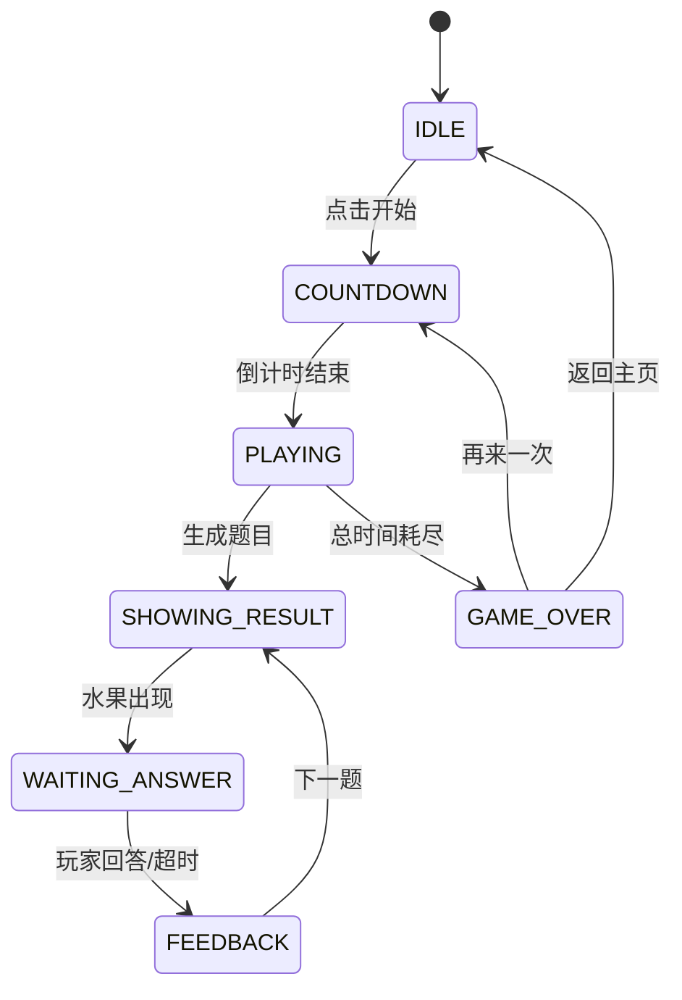

# 数一数 — 技术架构文档

## 1. 项目结构

```
C:\Dev\NumberGame\
├── assets/
│   ├── scenes/
│   │   ├── Start.scene           # 启动场景
│   │   └── Game.scene            # 游戏主场景
│   ├── scripts/
│   │   ├── AudioManager.ts       # 音效管理单例
│   │   ├── ScoreManager.ts       # 计分系统
│   │   ├── TimerManager.ts       # 计时管理
│   │   ├── FruitSpawner.ts       # 水果生成器
│   │   ├── ButtonPanel.ts        # 数字按钮面板
│   │   ├── ResultPanel.ts        # 结算界面
│   │   ├── GameManager.ts        # 游戏主控制器
│   │   └── StartScene.ts         # 启动场景控制
│   ├── prefabs/                  # 预制体目录
│   └── resources/
│       ├── audio/                # 音效文件 (5个WAV)
│       └── images/               # 水果图片 (20个PNG)
├── docs/                         # 项目文档
├── extensions/
│   └── cocos-mcp-server/         # MCP服务器扩展
├── settings/                     # 项目设置
└── package.json                  # 项目配置
```

---

## 2. 脚本架构

### 2.1 依赖关系

```
GameManager (主控制器)
├── AudioManager (音效)
├── ScoreManager (计分)
├── TimerManager (计时)
├── FruitSpawner (水果生成)
├── ButtonPanel (按钮输入)
└── ResultPanel (结算UI)
```

### 2.2 核心脚本职责

| 脚本 | 职责 | 主要方法 |
|------|------|----------|
| `GameManager` | 游戏状态机、流程调度 | `startGame()`, `nextQuestion()`, `onPlayerAnswer()` |
| `AudioManager` | 音效预加载和播放 | `preload()`, `play()` |
| `ScoreManager` | 计分、连击、评级 | `submitAnswer()`, `reset()`, `getStarCount()` |
| `TimerManager` | 总倒计时、每题倒计时 | `init()`, `startTimer()`, `resetQuestionTimer()` |
| `FruitSpawner` | 水果随机生成、动画 | `spawn()`, `clearFruits()` |
| `ButtonPanel` | 按钮输入处理、反馈 | `setEnabled()`, `setAnswerCallback()` |
| `ResultPanel` | 结算数据展示 | `show()`, `hide()`, `setCallbacks()` |
| `StartScene` | 启动场景控制 | `start()` |

---

## 3. 游戏状态机



### 状态说明

| 状态 | 说明 | 可执行操作 |
|------|------|------------|
| `IDLE` | 等待开始 | 显示"点击开始" |
| `COUNTDOWN` | 3-2-1倒计时 | 禁用按钮 |
| `PLAYING` | 游戏进行中 | 生成题目、计时 |
| `SHOWING_RESULT` | 显示水果 | 播放出现动画 |
| `WAITING_ANSWER` | 等待玩家回答 | 启用按钮、倒计时 |
| `FEEDBACK` | 显示反馈 | 禁用按钮、播放音效 |
| `GAME_OVER` | 游戏结束 | 显示结算界面 |

---

## 4. 核心算法

### 4.1 水果位置随机生成

```typescript
// generatePositions(count, areaW, areaH)
// 使用拒绝采样确保水果不重叠
for each fruit:
    do:
        x = random(-areaW/2, areaW/2)
        y = random(-areaH/2, areaH/2)
    while (距离已有水果 < minDist) && (尝试次数 < 100)
```

### 4.2 难度递进

```typescript
if (elapsed >= 20s):
    maxFruits = 5, questionTime = 3s
else if (elapsed >= 10s):
    maxFruits = 4, questionTime = 4s
else:
    maxFruits = 3, questionTime = 5s
```

### 4.3 计分公式

```typescript
base = reactionTime < 1s ? 20 : 10  // 闪电奖励
if (combo === 3) base += 15          // 3连击
if (combo >= 5) base += 25           // 5连击
score += base

// 答错
score = max(0, score - 5)
remainTime -= 1s
```

---

## 5. 动画系统

### 5.1 水果弹出动画

```typescript
// 从0缩放到1.2再回弹到1.0
tween(fruitNode)
    .to(0.15, { scale: v3(1.2, 1.2, 1) })  // 弹出
    .to(0.15, { scale: v3(1.0, 1.0, 1) })  // 回弹
    .start()
```

### 5.2 按钮点击动画

```typescript
// 缩放0.9再恢复
tween(btn)
    .to(0.05, { scale: v3(0.9, 0.9, 1) })
    .to(0.05, { scale: v3(1, 1, 1) })
    .start()
```

### 5.3 答错晃动动画

```typescript
// 左右晃动
tween(btn)
    .to(0.05, { position: v3(x-5, y, 0) })
    .to(0.05, { position: v3(x+5, y, 0) })
    .to(0.05, { position: v3(x-5, y, 0) })
    .to(0.05, { position: v3(x, y, 0) })
    .start()
```

---

## 6. 音效管理

### 6.1 音效映射

| 名称 | 文件 | 触发时机 |
|------|------|----------|
| `correct` | `correct-selection-sound.wav` | 答对时 |
| `wrong` | `elect-menu-go-back.wav` | 答错时 |
| `click` | `select-menu-select.wav` | 点击按钮时 |
| `appear` | `jump.wav` | 水果出现时 |
| `combo` | `laser.wav` | 连击>=3时 |

### 6.2 预加载策略

```typescript
// 在 GameManager.onLoad() 中预加载所有音效
audioManager.preload('correct', 'audio/correct-selection-sound');
audioManager.preload('wrong', 'audio/elect-menu-go-back');
audioManager.preload('click', 'audio/select-menu-select');
audioManager.preload('appear', 'audio/jump');
audioManager.preload('combo', 'audio/laser');
```

---

## 7. 性能优化

### 7.1 对象池
- 水果节点使用对象池管理
- 避免频繁 `new Node()` 和 `removeFromParent()`

### 7.2 资源缓存
- SpriteFrame 在 `FruitSpawner.onLoad()` 中预加载
- 使用 Map 缓存，避免重复加载

### 7.3 触控优化
- 按钮尺寸 >= 80px
- 按钮间距 >= 20px
- 使用 `TOUCH_END` 而非 `TOUCH_START` 防止误触

### 7.4 内存管理
- 同屏水果数 <= 5
- 游戏结束时清理所有水果节点
- 切换场景时释放资源

---

## 8. 扩展性设计

### 8.1 添加新关卡
1. 创建新的 `LevelXxx.ts` 脚本
2. 实现 `ILevel` 接口
3. 在 `GameManager` 中注册

### 8.2 添加新水果
1. 将图片放入 `assets/resources/images/`
2. 在 `FruitSpawner.FRUIT_NAMES` 中添加名称
3. 自动加载

### 8.3 添加新音效
1. 将音效放入 `assets/resources/audio/`
2. 在 `GameManager.onLoad()` 中添加预加载
3. 在需要的地方调用 `audioManager.play()`
